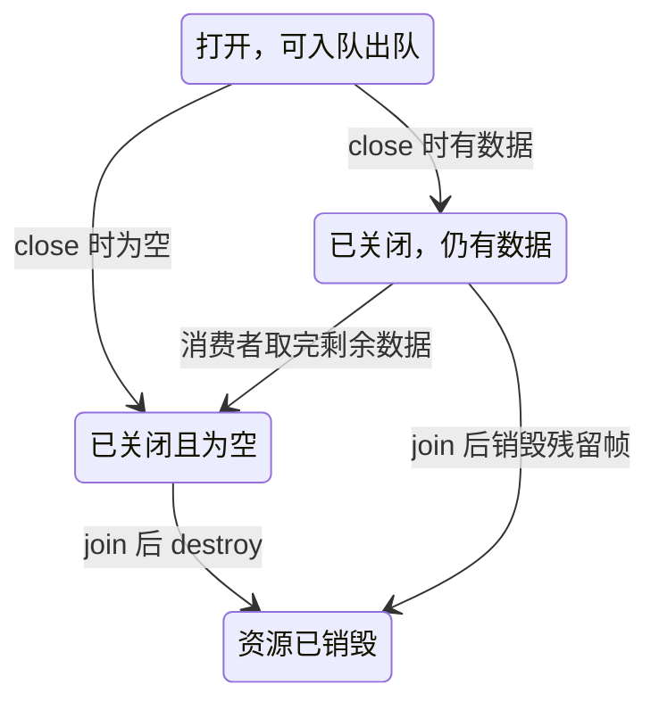

# 原始数据队列实现说明

## 一、背景

配置、日志和主程序启动流程已完成，并由用户完成 SDK 交叉编译和板端验证。
后续视频采集与编码、音频采集与编码将分别运行在线程中，需要安全传递数据。

本阶段实现原始数据有界队列 `frame_queue`，使用模拟数据独立验证。
不打开摄像头、声卡，不调用 MPP、FFmpeg，不连接 SRS，不生成录像。
程序仍沿用 SDK 配套工具链，本模块只依赖 libc 和 pthread。

## 二、任务与文件变化

| 文件 | 内容 |
|---|---|
| `include/media_types.h` | 完善原始帧字段注释，明确字节、像素、样本数及微秒单位；增加显式 PCM 格式字段 |
| `include/frame_queue.h` | 明确每个接口的参数、返回值、阻塞行为、所有权和线程安全限制 |
| `src/frame_queue.c` | 实现环形 FIFO、两种入队、阻塞出队、关闭唤醒、残留数据清理 |
| `tests/test_frame_queue.c` | 9 组独立行为测试，可本机编译，也可交叉编译后上板 |
| `Makefile` | 增加队列交叉编译、本机测试、可选 sanitizer 入口 |
| `src/main.c` | 更新阶段提示：原始帧队列已实现，但媒体业务未接入 |
| `scripts/build.sh`、`README.md` | 更新阶段状态和操作说明 |

本次不修改已验证的配置解析、日志实现、配置值、`demo/` 或 `shell/`。

## 三、方案与关键实现细节

### 3.1 队列的职责边界

视频和音频各创建一个 `IpcFrameQueue` 实例，复用同一套实现。

| 队列实例 | 生产者 | 数据 | 消费者 |
|---|---|---|---|
| 视频原始队列 | 后续 V4L2 采集线程 | NV12 帧及其布局、时间戳 | 后续 MPP 编码线程 |
| 音频原始队列 | 后续 ALSA 采集线程 | PCM 块及其采样参数、时间戳 | 后续 AAC 编码线程 |

队列只存放 `IpcRawFrame *`，不复制图像，不转换格式，也不重新计算时间戳。
当前主程序没有创建这两个实例；本阶段由独立测试程序创建和使用。
`packet_queue` 仍待实现，不能将本阶段的原始帧队列视为编码包队列已经完成。

容量以“帧/音频块数量”为单位，不是字节数。队列创建时只分配指针槽位，
帧和数据内存由生产者分配。因此，限制槽位数量不等于自动限制所有媒体内存：
采集端还需限制单帧大小、在途帧数量，以及失败重试时持有的数据。

### 3.2 原始数据结构

`IpcRawFrame` 分为公共字段和媒体专用字段。

| 字段 | 含义与要求 |
|---|---|
| `type` | 视频或音频，决定 `info` 使用哪一个分支 |
| `data` | 应用独占持有的连续堆内存，不得指向已归还驱动的缓冲区 |
| `size` | 数据的有效可访问字节范围；视频需要覆盖实际步长与平面偏移 |
| `pts_us` | 对齐应用共同起点的微秒时间戳，队列原样传递 |
| `info.video` | 宽高、FOURCC、Y/UV 行步长、UV 偏移和帧序号 |
| `info.audio` | 采样率、声道数、每声道样本数，以及显式 `S16_LE` 格式 |

对于 NV12，不能始终假定 Y 行步长等于宽度或 UV 偏移等于 `width * height`；
后续采集模块应根据设备实际布局填入。对于交错 S16_LE，音频有效字节数为
`每声道样本数 × 声道数 × 2`，计算时仍需做溢出和长度检查。

这些格式检查属于采集和编码模块。本队列只检查接口所需指针，不判断一块数据是否真的是 NV12/PCM。
测试中仅用少量字节模拟数据块，不代表完整图像或实际音频已验证。

### 3.3 环形 FIFO

内部维护固定长度的指针数组，以及以下状态：

- `head`：下一次出队位置。
- `tail`：下一次入队位置。
- `count`：当前有效元素数量，范围为 `0..capacity`。
- `closed`：是否已经关闭；关闭后不允许重新打开。

入队时写入 `slots[tail]`，更新 `tail = (tail + 1) % capacity`，增加 `count`。
出队时读取并清空 `slots[head]`，同样回绕索引，减少 `count`。

使用独立的 `count` 区分空和满，即使 `head == tail` 也不会混淆；
容量为 1 时同样有效。清空出队槽位可以避免销毁时重复释放已交给消费者的帧。

创建时检查 `capacity * sizeof(pointer)` 是否溢出。互斥锁、条件变量依次初始化，
中途失败则只清理已经初始化成功的资源；全部成功后才把队列句柄交给调用者。

### 3.4 为什么同时需要互斥锁和条件变量

互斥锁保护槽位、索引、数量和关闭标志，保证多个线程不会同时修改同一状态。
两个条件变量负责等待：

| 条件变量 | 等待者 | 等待结束条件 |
|---|---|---|
| `not_empty` | 消费者 | 有数据，或队列关闭 |
| `not_full` | 阻塞生产者 | 有空槽，或队列关闭 |

`pthread_cond_wait` 在进入等待时原子地释放互斥锁，返回前重新取得锁。
因此等待期间不会一直占锁，其他线程可以改变队列状态。

条件判断必须放在 `while` 中：条件变量可能虚假唤醒，多个等待线程中也可能有另一个线程先拿走数据或空槽。
被唤醒不等于条件仍成立，必须在持锁状态下重新检查。

每次入队只多出一帧，唤醒一个消费者；每次出队只多出一个空槽，唤醒一个生产者。
关闭影响所有线程，必须对两个条件变量执行 `broadcast`，否则可能有等待者永远收不到后续通知。

### 3.5 接口与返回值

所有错误都直接返回负 errno 值，不应使用 `perror()` 推断这些接口的错误。
若需要输出错误文本，对负返回值使用 `strerror(-ret)`。

| 接口 | 成功/结束 | 主要错误与约束 |
|---|---|---|
| `create(&queue, capacity)` | `0`：创建成功 | `queue` 必须初始化为 NULL；容量为零返回 `-EINVAL`，大小溢出返回 `-EOVERFLOW` |
| `try_push(queue, frame)` | `0`：队列接管帧 | 满返回 `-EAGAIN`，关闭返回 `-EPIPE`，不等待空槽 |
| `push(queue, frame)` | `0`：队列接管帧 | 满时等待；关闭后返回 `-EPIPE`，由调用者处理未入队帧 |
| `pop(queue, &frame)` | `1`：交付一帧；`0`：关闭且已空 | `frame` 必须先置 NULL；打开且为空时等待；错误返回负值 |
| `close(queue)` | 无返回值 | 幂等；拒绝新入队，唤醒等待者，保留剩余帧 |
| `destroy(&queue)` | 无返回值，将指针置 NULL | 所有线程退出并 join 后调用，释放残留数据 |
| `ipc_raw_frame_free(&frame)` | 无返回值，将指针置 NULL | 只能释放当前由调用者持有的堆帧 |

注意：`try_push` 仍需取得互斥锁，只是不会等待空槽，不属于无锁或严格实时接口。
阻塞 `push` 没有超时；上层应保证存在消费者，或最终调用 `close`。

### 3.6 数据所有权与释放

| 阶段 | 所有者 | 可以做什么 |
|---|---|---|
| 生产者刚申请并填写帧 | 生产者 | 修改内容、尝试入队、释放 |
| 入队失败 | 仍是生产者 | 根据返回值重试、记录异常或释放 |
| 入队成功 | 队列 | 生产者只清空自己的本地指针，不再读取或释放 |
| 出队成功 | 消费者 | 读取、处理，并最终调用统一释放接口 |
| 队列销毁时仍有残留帧 | 队列 | 统一释放残留描述对象和数据 |

`frame` 与 `frame->data` 必须是两个可以分别 `free()` 的分配，不能使用栈对象，
也不能把两个帧指向同一块数据。同一帧不能重复入队，不能交给两个队列共享。
否则队列无法阻止重复释放或并发访问。

当前释放函数不支持 MMAP、DMA-BUF、引用计数对象或自定义内存池；
未来引入零拷贝时，需要先扩展资源释放契约。

生产者入队成功后，消费者可能立即取出并释放帧，所以生产者连读取原帧的字段都不安全。
`pop` 要求输出指针为空，是为了防止覆盖调用者尚未释放的上一帧。

### 3.7 满队列策略

本阶段提供机制，不在通用队列里隐式丢媒体数据：

- 允许等待的上层可以使用 `push`。
- 需要自行决定丢帧或退出的上层可以使用 `try_push`，处理 `-EAGAIN`。
- 队列不会悄悄丢掉最旧视频帧，也不会悄悄丢音频块。

后续 V4L2 接入时应先复制有效数据到应用内存，并尽快归还驱动缓冲区。
是否丢旧视频帧、音频积压如何记录时间线影响，在相应采集模块中明确实现。
当前尚未提供原子“丢最旧并入新帧”的接口，不能把 `try_push` 当作已有此能力。

### 3.8 关闭、排空与销毁



正常收尾：生产者停止产生新数据 → 关闭队列 → 消费者继续取完数据，收到 `pop == 0` 后退出 →
管理线程 join 所有使用者 → 销毁队列。

若需要中断一个正在满队列等待的生产者，管理线程可先 `close`，让其返回 `-EPIPE`，
再由生产者释放未入队帧并退出；随后等待消费者排空并 join。
多生产者共用队列时，应由管理者在全部生产完成后统一关闭，不能任意一个生产者先完成就关闭。

`close` 只改变状态，不 join、不释放队列；立即 `destroy` 会让其他线程访问已释放内存。
本实现不支持 `pthread_cancel`。队列接口不能直接在异步信号处理函数里调用，
后续主程序应通过安全的通知机制让正常线程处理退出与关闭。

## 四、验证操作

### 4.1 Ubuntu 本机验证

项目根目录执行：

```bash
make host-queue-test  # 只编译并运行原始数据队列测试
make host-test        # 配置、日志及队列的完整本机回归
```

本机产物在 `bin/host/`，不能部署到 ARM64 开发板。
测试程序内部设置整体 30 秒超时，部分线程握手有 2 秒等待上限，异常时返回非零退出码，避免测试无限挂起。

### 4.2 SDK 交叉编译与板端验证

在 Ubuntu 项目根目录执行：

```bash
sh scripts/build.sh all queue-test
```

`all` 构建主程序，`queue-test` 构建测试程序但不在 Ubuntu 运行 ARM64 程序。

| 产物 | 用途 |
|---|---|
| `bin/ipc_camera` | 继续做配置校验及显示当前阶段状态 |
| `bin/test_frame_queue` | 本阶段需要上板执行的队列测试 |

将 `bin/test_frame_queue` 上传到板端 `/root/`，在开发板执行：

```bash
chmod +x /root/test_frame_queue
./root/test_frame_queue
echo $?  # 紧接上一条命令查看退出码；预期为 0
```

不需要上传配置，不需要摄像头、声卡或 SRS。
**预期**出现各项 `PASS`，最后一行为：

```text
PASS: 9 frame queue scenarios (no hardware required).
```

不要直接运行压缩包中的旧二进制；本交付包不携带主工程编译产物，应重新构建。
`ipc_camera --check-config` 只验证配置，不能代替此测试。

### 4.3 测试场景

| 编号 | 场景 | 检查重点 |
|---|---|---|
| 1 | 非法参数、安全清理 | 零容量、大小溢出、NULL、输出指针保护、重复释放空指针 |
| 2 | FIFO、队列已满、索引回绕、排空 | `-EAGAIN` 后所有权保留，关闭不丢已入队数据，关闭后入队失败 |
| 3 | 容量为 1、残留帧销毁 | 多次回绕、未消费帧及回绕队列的清理路径 |
| 4 | 空队列消费者等待 | 数据到达前未完成，入队后醒来取得数据 |
| 5 | 满队列生产者等待 | 空槽出现前未完成，出队后醒来完成入队 |
| 6 | 关闭空队列 | 3 个消费者全部醒来并返回结束 |
| 7 | 关闭满队列 | 3 个生产者全部醒来并保留失败帧，原队列数据仍可取出 |
| 8 | 音视频两条独立链路 | 四个线程共传递 20000 块模拟数据，检查类型、序号、内容和时间戳 |
| 9 | 多生产者、多消费者 | 3 个生产者、2 个消费者传递 6000 块，检查无重复和无遗漏 |

阻塞观察通过测试侧互斥锁、条件变量和有限观察窗口完成，不读取队列内部状态。
并发测试是行为验证，不是长期稳定性、性能或形式化无竞态证明。

### 4.4 可选内存检查

支持 sanitizer 的 Ubuntu 主机可以执行：

```bash
make host-queue-sanitize
```

默认同时请求地址、未定义行为和泄漏检查。若运行环境明确提示 LeakSanitizer 不支持被监控进程，
可仅运行前两项：

```bash
make host-queue-sanitize ASAN_OPTIONS=detect_leaks=0:halt_on_error=1
```

关闭泄漏检查后的成功不等于已验证无泄漏，不能将这项检查计为通过。

## 五、实际结果与当前边界

本次开发环境实际验证：

- 本机编译、链接及 9 组队列测试通过。
- 配置、命令行和启动路径 54 项回归通过。
- 400 条并发日志及级别过滤检查通过。
- 配置加载失败不覆盖调用者旧配置的检查通过。
- 队列代码与测试使用 `-Wall -Wextra -Wpedantic -Werror` 编译通过。
- AddressSanitizer、UndefinedBehaviorSanitizer 检查通过；运行时禁用了泄漏检查。
- LeakSanitizer 初次执行因环境不支持受监控进程而失败，泄漏检查未完成。


当前仍未接入摄像头、声卡、编码或媒体输出。后续先将 V4L2 采集端接到视频原始队列，
以消费线程核对数据与释放，再接入 MPP H.264 编码；本阶段不承诺实际视频帧率、延迟或音视频同步性能。
