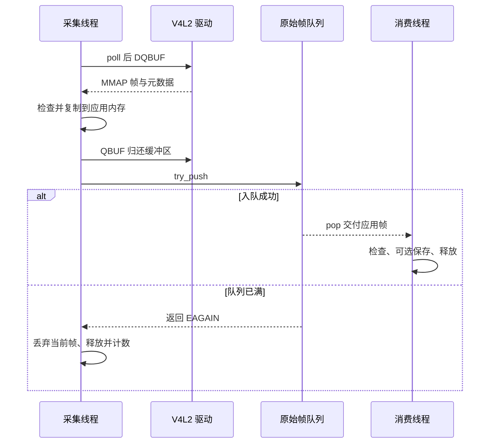

# V4L2 采集与队列接入说明

## 一、背景

上一阶段的原始数据队列已通过用户 RK3568 板端的 9 组测试，退出码为 0。
本阶段把队列中的模拟数据换成正式模块采集的摄像头图像，完成：

**IMX415 / ISP → `/dev/video0` → V4L2 → 应用自有 NV12 帧 → 视频队列 → 消费检查与可选保存。**

`demo/` 只作为已有实验参考，保持独立。正式程序不调用、不包含、不链接其中的源码或可执行文件。
实现位于正式 `src/`、`include/`；Makefile 的主程序源文件列表只来自 `src/*.c`。

## 二、本阶段任务与文件

| 文件 | 职责 |
|---|---|
| `include/v4l2_capture.h`、`src/v4l2_capture.c` | 设备能力、格式读回、MMAP 缓冲区、取帧复制、归还、时间戳、统计与清理 |
| `include/video_pipeline.h`、`src/video_pipeline.c` | 正式采集模式的线程组织、队列传递、文件保存、信号退出和统计 |
| `src/main.c` | 保留配置检查，新增显式 `--capture` 及相关参数 |
| `include/media_types.h` | 保留原始驱动时间戳、出队单调时间和回退标记 |
| `src/timestamp.c`、`include/timestamp.h` | 实现 `ipc_monotonic_us()`；音频和通用时间基换算仍待后续实现 |
| `tests/mock_v4l2.c`、`tests/test_capture.py` | 通过模拟系统调用验证正式代码，不依赖实际摄像头 |
| `Makefile`、`scripts/build.sh`、`README.md` | 新增本机测试入口，更新阶段说明与部署操作 |

新增及修改的 C 函数都包含功能注释；公开接口还说明参数、返回值、所有权与并发限制。
实现中的关键注释解释了为什么需要先复制再 QBUF、条件退出如何组织，以及失败路径回收哪些资源。

此阶段不包含音频、MPP 编码、画面实时显示、RTMP 推流或 MP4 录像。
`--dump` 保存的是未经编码的 NV12 验证文件，不是已实现了项目的本地录像模块。

## 三、实现方案

### 3.1 模块职责与线程分工

低层采集模块不依赖应用线程上下文，只提供可串行调用的设备接口。
`video_pipeline` 负责本阶段业务组织。它属于正式工程，后续可以把消费检查替换为编码接入。

原骨架中未实现的 `ipc_video_capture_thread(IpcApp *)` 草案不再保留；
实际线程入口由 `video_pipeline.c` 的私有函数实现，避免让设备模块依赖尚未完整定义的 `IpcApp`。

| 执行者 | 持有资源 | 工作 |
|---|---|---|
| 主线程 | 队列和采集上下文生命周期、线程句柄 | 初始化、接收退出信号、等待线程、统计与销毁 |
| 采集线程 | V4L2 `read/stop`、生产统计 | 有限等待取帧，复制并归还驱动，尝试入队，退出时停流并关闭队列 |
| 消费线程 | 文件写入、消费统计 | 取帧、检查、可选保存、释放；直到队列关闭且排空 |

跨线程停止与完成状态使用 C11 原子变量。生产/消费统计分别由其所属线程写入，
主线程在 join 后读取，不用 `volatile` 代替同步。



### 3.2 采集接口

| 函数 | 功能和返回约定 |
|---|---|
| `ipc_video_capture_init` | 打开、协商、映射、初始 QBUF；不启动流。成功 0，失败负 errno，输出句柄不变 |
| `ipc_video_capture_start` | 记录共同时间起点并 STREAMON；成功 0，失败负 errno |
| `ipc_video_capture_read` | poll、DQBUF、复制、QBUF；1 为交付一帧，0 为暂无帧，负值为错误 |
| `ipc_video_capture_stop` | 停流，可重复调用；必须与 read 串行 |
| `ipc_video_capture_get_format` | 复制实际布局，不暴露驱动映射地址 |
| `ipc_video_capture_get_stats` | 在线程结束后复制采集统计，不作为并发实时查询接口 |
| `ipc_video_capture_deinit` | 尽力释放全部资源，返回首个清理错误并清空句柄 |
| `ipc_video_pipeline_run` | 运行本阶段双线程链路，统一处理退出与异常 |

同一采集上下文不支持并发 read，不支持停止后再次 start；再次采集应重新 init。
`read` 的 `-EBADMSG` 表示坏帧已经丢弃并归还，调用者可继续等待。
其他负值结束本次链路；`deinit` 与任何采集操作都不能并发。

### 3.3 配置和驱动缓冲区

1. 以 `O_RDWR | O_NONBLOCK | O_CLOEXEC` 打开设备。
2. 通过 `QUERYCAP` 检查 `VIDEO_CAPTURE_MPLANE` 和 `STREAMING`，优先看 `device_caps`。
3. 用 `S_FMT` 请求 1280×720 NV12，再通过 `G_FMT` 读回实际值。
4. 只接受逐行 NV12、一个内存平面、有效步长和缓冲区大小；实际变成 4K、NV12M 或其他布局时明确失败。
5. 请求 4 个 MMAP 缓冲区，以驱动实际返回数量为准；允许 1..32 个，异常数量拒绝。
6. 对每个缓冲区 QUERYBUF、MMAP、QBUF；全部完成后才 STREAMON。

多平面 API 的 `v4l2_buffer.length` 表示平面数组元素数量，
`v4l2_plane.length` 才表示该平面的字节容量，不能混用。
这与 Linux 的 [V4L2 缓冲区定义](https://www.kernel.org/doc/html/v5.10/userspace-api/media/v4l/buffer.html)一致。

程序不重复验证整板功能，也不修改 sensor subdev、media link 或设备树。
此 ISP 节点此前不支持 G_PARM，因此程序不尝试强行设置帧率；`video.fps=30` 仍是目标值。

### 3.4 NV12 布局与复制边界

初版支持标准单内存平面 NV12：Y 在前、UV 交错数据在后，Y 与 UV 使用相同行步长。
UV 起点按 `stride × height` 计算；不把 `sizeimage` 当作 UV 偏移，也不从其大小猜测私有布局。
标准布局参见 [Linux NV12 格式说明](https://www.kernel.org/doc/html/v5.10/userspace-api/media/v4l/pixfmt-nv12.html)。

| 数值 | 本实现用途 |
|---|---|
| `bytesperline` | 实际行步长，允许大于有效宽度 |
| `sizeimage` | 驱动要求的缓冲区大小，可能大于有效图像 |
| `plane.length` | 实际映射容量，用于检查越界 |
| `data_offset` | 图像首字节相对于映射起点的偏移 |
| `bytesused` | 含 `data_offset` 的已用长度，不能直接当作图像数据长度 |

每次 DQBUF 后检查索引、错误标志、场格式、偏移和有效长度。
只需要最后 UV 行的有效像素存在，不会读取最后一行之外的尾部 padding。
若索引本身越界，不能继续访问数组或用该索引 QBUF，直接结束并停流回收。

应用帧按实际步长分配并清零，逐行只复制 `width` 个有效字节；
应用端的行填充保持为零。这样保留布局信息，也避免把未定义的驱动填充内容传入后续模块。
大小乘法前检查溢出，同时给单个缓冲区设置 64 MiB 的异常值上限。

复制完成后先 QBUF，再把帧交给调用者。即使发生分配失败或坏帧，只要索引可信，
也会尝试归还驱动缓冲区；QBUF 失败则释放应用副本并终止链路。

### 3.5 时间戳与帧率

启动流前获取 `CLOCK_MONOTONIC` 作为应用共同起点。
第一次有效布局帧到来时选择本次运行的时间戳来源：

- 驱动明确标记单调时钟，且时间戳位于共同起点与出队时刻之间：使用驱动时间戳。
- 否则固定回退到出队单调时钟，并打印警告、累计 `timestamp_fallback`。

驱动时间戳的时钟类型和采样位置由 flags 指示，不能仅凭一个 timeval 就认定可与本机起点相减。
依据见 [V4L2 时间戳与标志说明](https://www.kernel.org/doc/html/v5.10/userspace-api/media/v4l/buffer.html)。

`pts_us = 选定的绝对单调时间 - 应用共同起点`。
一旦选定驱动时间源，后续非法或不递增的时间戳会导致该帧丢弃，不会逐帧切换时间源来掩盖问题。
原始驱动时间戳、时间戳标志、出队时刻和回退标记仍保留在帧结构中。

回退时间是近似到达时间，不代表准确曝光时间，不能据此宣称已经完成音视频同步。
`capture_fps` 按有效帧的首末出队时刻计算 `(captured - 1) / 时间差`；
这是应用收到有效帧的速率，不是通过设置参数保证的 sensor 帧率。

### 3.6 队列满、坏帧与超时

采集端使用 `try_push`。满时丢弃**当前新帧**、释放内存并增加 `dropped_full`，
不会修改队列中已有数据。这个阶段先采用简单且可核对的策略；丢旧帧或零拷贝可在后续实时性优化时设计。

单次 poll 最多等待 250ms。连续 3 秒没有得到有效帧则报错退出；
超时、EAGAIN 或坏帧不会无限重置等待期限，避免摄像头持续异常时程序永久运行。
250ms 是 poll 的检查周期，不是对任意驱动 ioctl、磁盘写入或整体退出时长的硬实时保证。

消费端若检查失败或写文件失败，会请求采集停止，并继续取出/释放剩余队列元素。
此时程序最终返回失败，不能把“排空成功”当成整个采集过程成功。

### 3.7 保存与退出

`--dump` 用独占创建方式打开新文件，已有文件不会覆盖。应用帧保持驱动步长，
写出时按 Y、UV 顺序逐行去掉填充，因此文件是一帧接一帧的紧凑 NV12。
程序会检查 fwrite 及最终 fclose；写入失败可能留下部分文件，最终日志和退出码会报错。

主线程在创建业务线程前屏蔽 SIGINT/SIGTERM；线程继承该状态。
主线程通过 `sigtimedwait` 接收退出请求，再设置原子停止标志，避免在异步信号处理函数中加锁或写日志。

正常或受控中断顺序：采集线程结束 read → STREAMOFF → 关闭队列 → 消费者排空退出 →
join 两线程 → 刷新并关闭文件 → 解除 MMAP → REQBUFS(0) → 关闭设备 → 销毁队列。
初始化或线程启动失败时也走统一清理；没有生产者时由主线程关闭队列，唤醒已经启动的消费者。

| 退出码 | 含义 |
|---|---|
| `0` | 达到有效采集帧数上限，消费与清理成功 |
| `130` | SIGINT/SIGTERM 请求的受控中断，清理成功 |
| `1` | 设备、采集、写入或资源清理失败 |
| `2` | 命令行参数错误 |

## 四、验证步骤

### 4.1 Ubuntu 编译与部署

将交付文件合并到原工程，保留自己的 `.git/`，在项目根目录执行：

```bash
sh scripts/build.sh  # 沿用 SDK 工具链和 sysroot，生成 bin/ipc_camera
```

将新生成的 `bin/ipc_camera` 和 `configs/ipc.conf` 分别上传到开发板：

- `/root/ipc_camera`
- `/root/ipc.conf`

本阶段没有新增必填配置项，原来的音频开发初值、RTMP 禁用和占位 URL 保持不变。
仅打开 `video.device`，其余配置不会触发声卡、网络或 MP4 操作。

### 4.2 连续采集并保存少量画面

确认上一轮预览/采集程序已经退出，避免同时占用摄像头。开发板执行：

```bash
chmod +x /root/ipc_camera
/root/ipc_camera --config /root/ipc.conf --capture --frames 300 \
  --dump /userdata/capture_720p.nv12 --dump-frames 60
echo $?  # 必须紧接采集命令查看，正常完成预期 0
```

`capture_720p.nv12` 必须是新文件；如果已存在，换一个文件名即可，不会自动覆盖。

| 参数 | 含义 |
|---|---|
| `--capture` | 显式启动真实视频采集；不传则仍仅检查配置 |
| `--frames 300` | 得到 300 个有效采集帧后结束，含因队列满而丢弃的新帧 |
| `--dump PATH` | 创建一个新 NV12 文件；不传则只检查和释放帧 |
| `--dump-frames 60` | 最多保存前 60 个消费帧，实际数量以 `saved` 为准 |
| `--frames 0` | 持续运行，直到受控中断或采集错误 |
| `--consumer-delay-ms N` | 人工延迟消费，用于积压测试；默认 0，最大 1000ms |

预期日志包括：

```text
actual: 1280x720 fourcc=NV12 planes=1 ... stride=... sizeimage=...
timestamp source: ...
summary: dequeued=... captured=300 enqueued=... dropped_full=... dropped_stop=0 consumed=... saved=60
invalid=... timestamp_rejected=... sequence_gaps=... ... capture_fps=...
capture complete; queue drained and resources released
```

上面是预期格式，不是本次已取得的真实板端结果。`stride` 可以大于 1280，
`sizeimage` 也可能大于紧凑帧大小，满足校验即可。

开发板查看采集视频：
```
# 先设置显示环境
export XDG_RUNTIME_DIR=/run
export WAYLAND_DISPLAY=wayland-0
export SDL_VIDEODRIVER=wayland
export SDL_RENDER_DRIVER=software

# 循环播放
ffplay -f rawvideo -pixel_format nv12 -video_size 1280x720 -framerate 25 -i /root/rk3568_ipc_camera/capture_720p_fixed.nv12 -loop 0 -fs
# 参数说明：
# loop 0：无限循环，便于观察这段只有 2.4 秒的视频。
# -fs：全屏显示。
# 退出：在播放窗口按 q，或者在启动命令的终端按 Ctrl+C。
```

### 4.3 如何解读统计

| 字段 | 含义 |
|---|---|
| `dequeued` | DQBUF 成功次数，包含之后被检查为无效的帧 |
| `captured` | 成功复制且 QBUF 成功的有效帧数 |
| `enqueued` | 成功交给应用队列的帧数 |
| `dropped_full` | 应用队列满时丢弃的新帧数 |
| `dropped_stop` | 已复制但因停止或入队错误而未交付的帧数 |
| `consumed` | 从队列取出并最终释放的帧数 |
| `saved` | fwrite 已完整接受的紧凑帧数；还需最终 fclose 成功 |
| `invalid` | 布局、错误标记或时间戳检查未通过而丢弃的帧数 |
| `timestamp_rejected` | `invalid` 中由于时间戳非法/不递增被拒绝的部分 |
| `sequence_gaps` | 相邻驱动序号的向前缺口，与应用队列丢帧分别统计 |
| `sequence_resets` | 驱动序号重复或异常回退次数；正常 uint32 回绕按差值处理 |
| `timestamp_fallback` | 使用出队时刻代替驱动时间戳的有效帧数 |
| `poll_timeouts`、`eagain` | 等待窗口超时及非阻塞暂不可取的次数，不单独表示链路失败 |
| `capture_fps` | 首末有效帧出队时刻计算的实测到达速率 |

正常排空后应满足：

```text
captured = enqueued + dropped_full + dropped_stop
enqueued = consumed
```

无坏帧、无积压时，通常能看到 `captured=enqueued=consumed=300`、`saved=60`。
若存在队列丢帧，数量关系仍应闭合，但需要记录积压原因，不能宣称无丢帧。
`dequeued` 和 `captured` 不要求始终相等，错误帧与致命 QBUF 错误也会影响差值。

### 4.4 图像文件检查与回放

正常收尾的紧凑 NV12 文件大小应为：

```text
每帧 = 1280 × 720 × 3 / 2 = 1,382,400 字节
60 帧 = 82,944,000 字节
```

先按 `saved` 核对大小，再将文件下载到 Ubuntu 图形桌面运行：

```bash
ffplay -f rawvideo -pixel_format nv12 -video_size 1280x720 \
  -framerate 30 capture_720p.nv12
```

RAW 文件没有自带尺寸、格式或时间戳，需要播放器显式参数。
这里 30 只是指定播放速度，不能用播放速度反推实测摄像头帧率；
队列丢帧造成的真实时间间隔也没有保存到这个裸文件中。
参数依据见 [FFmpeg rawvideo 说明](https://ffmpeg.org/ffmpeg-formats.html#rawvideo)及
[FFplay 文档](https://ffmpeg.org/ffplay.html)。

主要检查：画面是否正常、是否错位/花屏、是否存在明显颜色异常。
此项验证在 Ubuntu 进行，避免将板端显示环境问题混入采集链路；不新增实时预览依赖。

### 4.5 中断与再次启动

开发板执行：

```bash
/root/ipc_camera -c /root/ipc.conf --capture --frames 0
# 运行一段时间后按 Ctrl+C，等待清理日志出现
echo $?  # 受控中断预期 130

/root/ipc_camera -c /root/ipc.conf --capture --frames 60
echo $?  # 再次启动并正常完成预期 0
```

第一次应出现 `capture interrupted; queue drained and resources released`；
第二次应重新打开、映射、启动并完成采集。这样才验证到了设备生命周期的可重复使用。

如要单独观察积压策略，可以执行以下可选测试：

```bash
/root/ipc_camera -c /root/ipc.conf --capture --frames 150 --consumer-delay-ms 100
```

人工延时大于帧间隔时，预期 `dropped_full` 增加，但程序仍能结束，且 `enqueued=consumed`。
不要用这一模式的结果评价默认配置下的采集性能。

### 4.6 本机模拟和回归测试

```bash
make host-capture-test  # 仅运行采集模块的模拟集成测试
make host-test          # 配置、日志、队列及模拟采集的全部回归
```

`ipc_camera_mock` 将测试侧系统调用替换层链接到正式代码，模拟：

- 带行填充、非零数据偏移及缺少最后一行尾部 padding 的合法帧。
- QBUF 后立即改写 MMAP 内容，逐像素检查输出，验证应用帧确实独立。
- 空能力、格式不匹配、多内存平面、缓冲区申请/查询/映射/启停失败。
- 错误标志、短帧、非法偏移/长度/索引、EAGAIN、未知时间源和倒退时间戳。
- 没有帧、持续坏帧、队列满、消费者写入失败、文件收尾失败。
- 两个线程分别创建失败、Ctrl+C、命令行异常，以及资源回收。

模拟层只进入独立测试程序，正式 `bin/ipc_camera` 不链接它。
优化编译下启用 FORTIFY 时，测试侧同时适配 `poll` 和 `__poll_chk`，保持边界检查。

可选内存检查：

```bash
make host-capture-sanitize
```

若当前容器不支持 LeakSanitizer，可显式只运行地址及未定义行为检查：

```bash
make host-capture-sanitize ASAN_OPTIONS=detect_leaks=0:halt_on_error=1
```

## 五、验证结果与边界

本次开发环境已完成：

| 项目 | 实际结果 |
|---|---|
| 本机编译、链接 | 通过；sanitizer 构建使用 `-Wall -Wextra -Wpedantic -Werror` |
| 模拟采集集成 | 42 个场景通过，包含文件内容逐像素比较和资源回收断言 |
| AddressSanitizer / UndefinedBehaviorSanitizer | 同一 42 场景通过，泄漏检查已禁用 |
| 配置、CLI、启动路径回归 | 54 项通过 |
| 日志回归 | 400 条并发日志及级别过滤通过 |
| 配置失败不覆盖原值 | 通过 |
| 原始数据队列回归 | 9 组通过 |
| 新增及修改函数功能注释 | 已逐一核对 |

初版已由用户交叉编译并执行板端采集：驱动交付 74 帧，但全部被应用校验拒绝，退出码 1。
下面补充了本次兼容修复；修复版仍待重新交叉编译、上板采集、画面回放和中断重启验证。
模拟驱动结果不算作硬件验证，禁用泄漏检查也不代表已证明无泄漏。

上板返回日志时，优先保留实际布局、时间戳来源、最终统计、退出码及画面是否正常的结论。
这些确认后，再将视频消费端接入 MPP H.264 编码；当前不声称具备编码、推流、MP4 或音视频同步能力。


## 六、首次板端丢弃全部帧的排查与兼容修复

### 6.1 日志已证实的事实

- G_FMT 已返回 1280×720、NV12、一个内存平面、field=1、stride=1280、sizeimage=1382400。
- 已成功映射 4 个缓冲区，DQBUF 成功 74 次，驱动序号没有缺口。
- 每帧 bytesused=1382400、data_offset=0，长度与紧凑 720P NV12 相符。
- invalid=74、captured=0、timestamp_rejected=0，说明拒绝发生在时间戳检查之前。
- flags=0x2001 不含 V4L2_BUF_FLAG_ERROR（0x0040）；不能把 flags 非零等同于坏帧。
- 三秒超时是一直未取得“通过应用校验的帧”的结果，不等于摄像头完全没出帧。

### 6.2 具体判断与修复范围

旧代码要求每次 DQBUF 返回的 buffer.field 必须为 FIELD_NONE(1)。
若 G_FMT 为 NONE，但逐帧 field 没有填写而保持 ANY(0)，则有效图像也会被拒绝。
本机模拟这种差异已复现“全部丢弃 → 三秒超时 → 返回 1”。
**原板端日志缺少 DQBUF 的 field/planes 等信息，因此 field=0 尚属最可能原因，不能写成已确认的板端事实。**

标准要求驱动返回有效的场类型；ANY 不是应该正常返回的已确定场格式。
本次把兼容处理限制为：QUERYCAP 的 driver 以 rkisp 开头，且 G_FMT 已严格验证为
720P、NV12、逐行 FIELD_NONE 的上下文。其他驱动的 ANY、明确的隔行/顶场/底场、
错误标志、平面数量错误、数据截断和越界仍然拒绝。
标准定义见 [V4L2 场类型](https://www.kernel.org/doc/html/v5.10/userspace-api/media/v4l/field-order.html)
及 [缓冲区 field 与 flags](https://www.kernel.org/doc/html/v5.10/userspace-api/media/v4l/buffer.html)。

新增首帧日志输出 driver、card、index、planes、field、bytesused、offset、mapped、flags。
无效帧日志也补齐这些字段及 required，便于判断其他拒绝条件。
触发兼容时仅提示一次：

```text
RKISP DQBUF field=ANY(0); using negotiated progressive FIELD_NONE(1)
```

### 6.3 验证与重试

补充 4 个场景：RKISP ANY 接受并逐像素验证图像；非 RKISP ANY 拒绝；
RKISP 明确隔行帧拒绝；逐帧平面数量异常拒绝。总计 42 个模拟集成场景通过，
地址与未定义行为检查通过（泄漏检查禁用）。该结果不代替修复后的上板确认。

Ubuntu 覆盖修复文件后执行 `sh scripts/build.sh`，上传新的 `bin/ipc_camera`。
板端配置沿用用户实际路径 `/root/configs/ipc.conf`，使用新文件名避免旧失败输出触发 EEXIST：

```bash
./ipc_camera --config /root/configs/ipc.conf --capture --frames 300 --dump /userdata/capture_720p_fixed.nv12 --dump-frames 60
echo $?
```

请保留首帧 DQBUF 日志、是否出现兼容提示、最终统计及退出码。
若仍被拒绝，应按新增字段定位，不继续无条件放宽所有校验。

板端成功播放，同时实际采集帧率是 25 fps，尚未达到配置目标 30 fps。