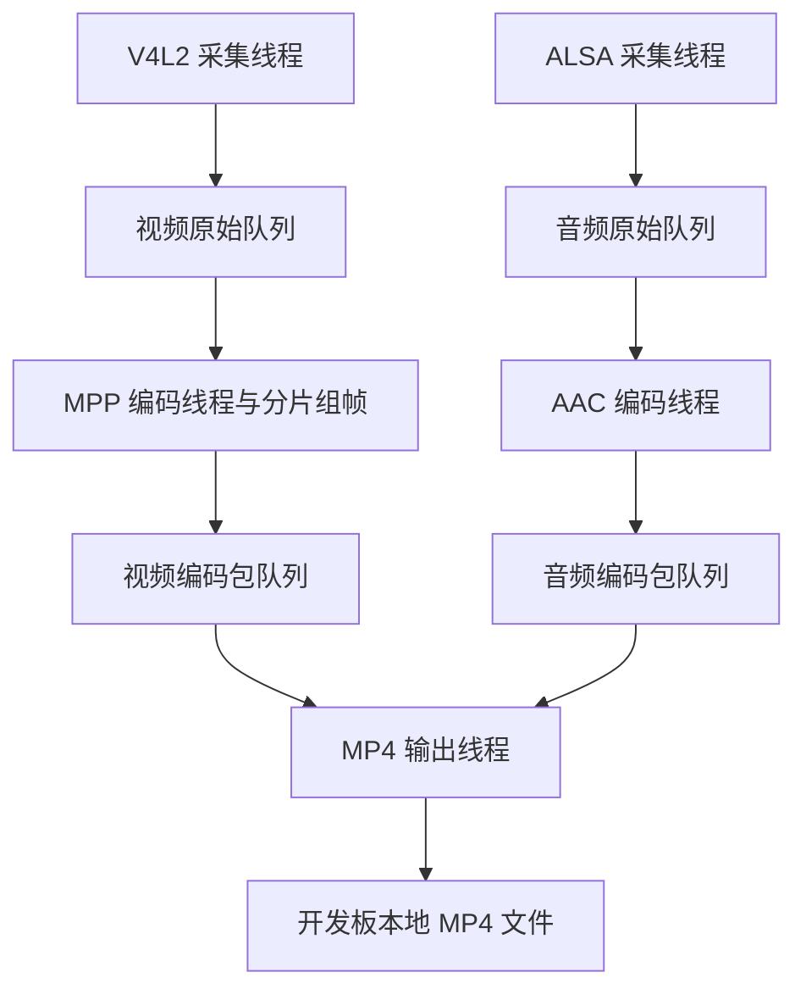

# 音视频并行录像与 MP4 本地回放

## 1. 任务与当前边界

前置阶段已在开发板分别验证 V4L2→NV12、MPP→H.264、ALSA→PCM、AAC→ADTS。
本次新增 `--record`，让音视频同时采集、编码，并封装为一个可在开发板直接播放的 MP4。

视频：1280×720 NV12、MPP H.264 Baseline I/P、实测 25fps、2Mbps、GOP30。
音频：`hw:0,0`、48000Hz、双声道 S16_LE、AAC-LC 128kbps。
本阶段只有本地录像输出；RTMP、两路输出分发、断电恢复、文件分段、时钟漂移补偿尚未实现。

## 2. “独立调试模式”是什么意思

独立调试模式是正式程序的单链路运行入口，用来隔离问题，并非另一套 demo。
例如 MP4 没有声音：先录 PCM 并回放，检查麦克风/声卡；再录 AAC 并回放，检查编码。
若两者正常，再排查 MP4 音轨、时间戳和播放器声卡选择。
如果视频花屏，先看 NV12；原始画面正常而 H.264 异常时，优先检查编码及码流。

| 模式 | 独立检查的范围 | 不会同时执行的部分 |
|---|---|---|
| `--capture --dump` | 摄像头、V4L2、原始视频队列、NV12 保存 | MPP、音频、MP4 |
| `--encode --output` | 摄像头、视频队列、MPP、H.264 保存 | 音频、MP4 |
| `--audio-capture --pcm` | 声卡、ALSA、原始音频队列、PCM 保存 | AAC、视频、MP4 |
| `--audio-encode --aac` | 声卡、音频队列、AAC、ADTS 保存 | 视频、MP4 |
| `--record --mp4` | 两路同时采集编码、编码包队列、MP4 和共同时间轴 | RTMP |

在开发板 `/root/rk3568_ipc_camera/` 中单独录音定位问题，每条命令分别执行，文件须不存在：

```bash
./ipc_camera --config ipc.conf --audio-capture --seconds 10 --pcm debug_mic_01.pcm
echo $?
sh ./play_pcm.sh debug_mic_01.pcm 48000 2
./ipc_camera --config ipc.conf --audio-encode --seconds 10 --aac debug_aac_01.aac
echo $?
sh ./play_aac.sh debug_aac_01.aac
```

这些检查期间不要同时运行其他占用同一摄像头/声卡的程序。原有视频调试命令保持有效：

```bash
./ipc_camera --config ipc.conf --capture --frames 300 --dump debug_video_01.nv12 --dump-frames 60
./ipc_camera --config ipc.conf --encode --frames 300 --encode-fps 25 --output debug_video_01.h264
sh ./play_h264.sh debug_video_01.h264
```

NV12 原始数据的板端回放命令仍见 README；独立模式每次只运行一个。

## 3. 工程与线程关系

| 模块 | 本阶段职责 |
|---|---|
| `record_pipeline` | 私有运行上下文、五个工作线程、共同 epoch、信号、错误传播、join 和统计 |
| `packet_queue` | 有界 AVPacket 队列、独立引用、限时出队、关闭唤醒、残留释放 |
| `h264_bridge` | 复制 MPP 头和分片、组装完整图像包、确定视频包 duration |
| `mp4_output` | 双轨参数复制、时间基换算、交错写入、容器收尾、自定义文件 I/O |
| `play_mp4.sh` | 在开发板同一个 ffplay 中按音频时钟播放画面和声音 |



主线程管理资源及停止信号，不直接做实时写盘。所有设备、编码器、队列和 MP4 头就绪后，
取得一次 `CLOCK_MONOTONIC` 起点并传给两个采集线程。五个工作线程分别为两采集、两编码、一输出。
当前不实现每个输出两条队列的双输出分发；以后可利用独立包引用增加 RTMP 输出。

### 3.1 所有权与有界缓存

- 原始帧成功入队后由队列接管；失败仍归生产者。消费者调用编码器后释放 PCM/NV12。
- MPP 回调里的缓冲只在回调期间有效；桥接器复制数据，按 `frame_end` 合并同一图像分片。
- AAC 回调中创建独立 AVPacket 引用；不同输出若需修改 PTS/stream_index，必须使用不同 AVPacket 对象。
- 编码包入队失败不接管对象；队列满报错停止录像，不静默丢弃可能影响解码参考的压缩包。
- 视频桥接最多缓存一个待组帧包和一个完整待输出帧；单帧累计上限 16MiB，头信息上限 1MiB。
- 音频暂存一个末包，以便编码完成后扣除显式尾部补零的 duration。
- MP4 线程各借出一个队首包；两路都就绪时比较 DTS，某路 EOF 后继续排空另一路。
  空队列每次最多等待 10ms，不永久堵在单条空队列。

原始队列与编码包队列容量沿用配置。录像模式原始队列满也失败停止，避免把明显积压当作成功录像。
独立视频调试模式原有丢帧统计策略保持不变。普通 MP4 的索引元数据随时长增长；有界队列不代表任意长录像的全部内存恒定。

### 3.2 时间戳与同步边界

- 视频保留 V4L2 单调时间戳相对于共同 epoch 的偏移；不按“帧号/25”覆盖采集 PTS。
- 音频沿用声卡软件启动时刻估计加累计样本数；ADC/驱动缓冲延迟未做硬件校准。
- 不把两路首帧分别归零；摄像头较晚出帧时，MP4 保留相对偏差。
- MPP 使用无 B 帧的 Baseline，DTS=PTS；相邻图像 PTS 差决定前一帧 duration，末帧用配置帧率估计。
- AAC 使用 `1/sample_rate` 时间基，保留编码器预卷导致的较早/负包 PTS。
- MP4 显式启用 edit list，避免分别平移两条流。流的 start_time 可能包含编码预卷，不等同第一段可听声音的时刻。
- 封装时依据写头后的真实流时间基换算包时间戳。H.264 Annex B 的 SPS/PPS 和图像由 MP4 封装器转换成容器所需形式，AAC 直接送编码包，不添加 ADTS 头。
- MP4 最后一个 AAC 包的 duration 扣除本工程额外补齐的静音样本；`initial_padding` 是另一项编码器延迟。

本阶段建立共同时间轴及基本同步，不宣称已消除物理启动延迟或长期声卡/摄像头时钟漂移。
`timing` 日志的音频输入末端和视频末帧时间可辅助观察，但不直接代表已校准的音画误差。

### 3.3 停止与错误处理

正常限时结束或 SIGINT/SIGTERM：停止采集 → 关闭原始队列 → 编码线程排空并提交 EOS/EOF →
关闭编码包队列 → MP4 排空双轨 → 写 trailer、刷新并关闭文件 → join 和释放资源。

未创建成功的生产线程不会关闭队列，主线程补齐关闭动作。输出失败时关闭编码包队列，
使编码回调立即失败并停止，剩余数据仅释放，避免消费者退出后生产者继续积压。

文件使用 `O_EXCL`，拒绝覆盖，包括已存在的符号链接；不自动创建父目录。
自定义 AVIO 处理短写/EINTR，独立记录写入和 seek 错误，检查 trailer、缓冲刷新和 close。
出现错误返回 1，文件即使存在也只作为残留供排查；不能根据文件大小宣告完整。
SIGINT/SIGTERM 收尾成功返回 130；若停止太早导致任一轨没有数据，返回错误而非宣称完成双轨录像。
普通 MP4 不保证断电、SIGKILL 后可播放；内核驱动/磁盘调用也不承诺硬实时停止上限。

## 4. Ubuntu 构建与部署

在工程根目录：

```bash
sh scripts/build.sh -B
```

沿用原 RK3568 SDK；新增 `libavformat` 依赖，脚本检查 SDK 中 `libavformat/avformat.h`。
默认 MPP、ALSA、FFmpeg 均启用。不要将主机测试二进制或主机库上传到板端，也不需要升级板端 FFmpeg。

| Ubuntu 文件 | 上传到板端 `/root/rk3568_ipc_camera/` |
|---|---|
| `bin/ipc_camera` | `ipc_camera` |
| `scripts/play_mp4.sh` | `play_mp4.sh` |
| `configs/ipc.conf` | `ipc.conf`，保留已验证的声卡/摄像头参数 |

此前 `play_h264.sh`、`play_pcm.sh`、`play_aac.sh` 可以继续使用。
`output.record_path` 从本阶段起作为 `--record` 的默认输出路径，`--mp4 PATH` 可覆盖它。
配置中的默认父目录若不存在，应先自行创建，或像下面一样显式指定已经存在的工作目录。

## 5. 开发板验收

### 5.1 录制约 30 秒并检查双轨

每条命令单独执行，新文件须不存在，录制时让摄像头拍到说话/拍手动作：

```bash
cd /root/rk3568_ipc_camera
chmod +x ipc_camera
./ipc_camera --help
./ipc_camera --config ipc.conf --record --seconds 30 --encode-fps 25 --mp4 /root/rk3568_ipc_camera/record_av_01.mp4
echo $?
ffprobe -v error -show_entries stream=index,codec_name,profile,width,height,sample_rate,channels,start_time,duration,avg_frame_rate -show_entries format=duration,size -of default=noprint_wrappers=1 /root/rk3568_ipc_camera/record_av_01.mp4
sh ./play_mp4.sh /root/rk3568_ipc_camera/record_av_01.mp4
```

帮助应包含 `--record` 和 `--mp4`，否则先核对是否替换了新程序。`echo $?` 紧跟录制命令。
`--seconds` 默认录像 30 秒、独立音频 10 秒；`--seconds 0` 持续运行。
`--encode-fps 25` 仍是编码标称值，不能强制摄像头变成 25fps。

验收要点：

| 项目 | 预期 |
|---|---|
| 退出码 | 正常为 0 |
| 视频计数 | `video_enqueued=video_encoded=video_packets`，均大于零 |
| 排空/收尾 | `video_eos=1 audio_drained=1 trailer=1`，出现 `record complete` |
| 音频 | `audio_samples` 和 `audio_packets` 大于零；程序内部核对入队、消费、编码包、写入数 |
| MP4 流 | 一条 H.264 1280×720，一条 AAC 48000Hz/2 声道 |
| 长度/帧数 | 约 30 秒；启动偏差和最后一帧时长会影响长度，不强求恰好 750 帧或 1440000 样本 |
| 实际播放 | 开发板画面、声音正常，拍手声与动作无明显错位 |

`avg_frame_rate` 可能受采集时间戳、启动/停止边界影响，不要求精确打印 25/1。
`xruns/suspends` 应为 0；驱动坏帧、序列间隙和时间戳回退均打印，不能忽略异常长期积累。
播放器默认使用已验证的 Wayland/软件渲染和 SDL ALSA `plughw:0,0`，声音与画面在同一 ffplay 内同步。
如果只有画面没有声音，先看是否存在 AAC 音轨，再使用已验证的独立 AAC 回放检查声卡。
可临时覆盖播放设备：

```bash
AUDIODEV=plughw:0,0 sh ./play_mp4.sh /root/rk3568_ipc_camera/record_av_01.mp4
```

### 5.2 Ctrl+C 收尾

```bash
./ipc_camera --config ipc.conf --record --seconds 0 --encode-fps 25 --mp4 /root/rk3568_ipc_camera/record_stop_01.mp4
```

录制数秒后按 Ctrl+C，再执行：

```bash
echo $?
sh ./play_mp4.sh /root/rk3568_ipc_camera/record_stop_01.mp4
```

预期退出码 130、双编码排空、`trailer=1`，文件可正常播放。

### 5.3 检查较长录制的稳定性

```bash
./ipc_camera --config ipc.conf --record --seconds 300 --encode-fps 25 --mp4 /root/rk3568_ipc_camera/record_long_01.mp4
echo $?
sh ./play_mp4.sh /root/rk3568_ipc_camera/record_long_01.mp4
```

在录制开始和接近结束时分别拍手，观察声音与动作偏差是否扩大。
同时检查是否发生队列满、XRUN、写盘失败；如果偏差逐渐扩大，后续再依据日志处理设备时钟漂移，
不通过分别归零或随意删音频包掩盖问题。磁盘需有足够空间；2Mbps 视频加 128kbps 音频仅是目标码率估算。

## 6. 主机验证

```bash
make host-test
```

真实 AAC/MP4 测试需要主机 FFmpeg 4.4.1 的开发头文件和库，以及 ffmpeg/ffprobe；
测试输入 H.264 固定图像由主机 ffmpeg 的 libx264 生成。以下示例使用主机库安装目录 `/tmp/ipc-ffmpeg44`：

```bash
make host-record-test FFMPEG_INCLUDE=/tmp/ipc-ffmpeg44/include FFMPEG_LIBS='-L/tmp/ipc-ffmpeg44/lib -lavformat -lavcodec -lswresample -lavutil -lm'
make host-record-sanitize FFMPEG_INCLUDE=/tmp/ipc-ffmpeg44/include FFMPEG_LIBS='-L/tmp/ipc-ffmpeg44/lib -lavformat -lavcodec -lswresample -lavutil -lm' ASAN_OPTIONS=detect_leaks=0:halt_on_error=1
make host-aac-test FFMPEG_INCLUDE=/tmp/ipc-ffmpeg44/include FFMPEG_LIBS='-L/tmp/ipc-ffmpeg44/lib -lavformat -lavcodec -lswresample -lavutil -lm'
```

覆盖编码包引用与元数据独立、容量/超时/关闭排空、3000 个包并发、视频分片组帧与尾片缺失、
真实 AAC 编码/MP4 封装/独立双轨解码、起始偏差、DTS 单调、正常/信号停止、五个线程创建失败位置、
采集/编码/队列/文件写入/seek/close 失败及覆盖保护。
主机设备与 MPP 是替身，不将它们等同于 RK3568 的硬件性能验证。
ASan/UBSan 检查应用代码，本次第三方静态库未加 sanitizer，LeakSanitizer 关闭；不宣称完整验证第三方库或无内存泄漏。

FFmpeg 接口依据：[4.4 封装 API](https://ffmpeg.org/doxygen/4.4/group__lavf__encoding.html)。

本次验证结果：

- 原有配置、日志、原始队列、V4L2 42 项、MPP 59 项、ALSA 64 项回归通过。
- 原有 AAC 41 项真实编码/API/集成检查通过。
- 新增录像 41 项检查通过，生成双轨 MP4 经独立解码验证；3000 个编码包并发及桥接检查通过。
- 相同录像/队列/桥接检查通过 ASan/UBSan；MPP、ALSA、FFmpeg 同时启用的全部正式源文件通过主机 `-Werror` 对象编译。
- 回放脚本的路径引用、参数/声卡环境传递、Wayland 缺失处理通过替身播放器验证。
- 未在当前环境执行 ARM64 SDK 交叉编译或真实板端录制；实际回放、较长录制同步需按第五节验收。

