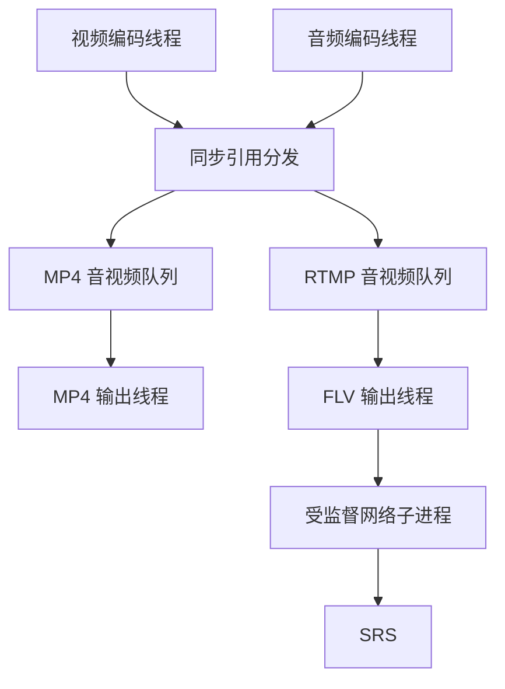

# RTMP 推流与本地 MP4 双输出

## 1. 本阶段范围

已有 NV12、H.264、PCM、AAC 独立调试及 MP4 录像保持可用。新增编码包引用分发、FLV/RTMP 输出、网络故障隔离、可结束的网络阻塞处理。网络链路由用户确认可达，SRS 地址沿用工程部署文档：

```text
rtmp://192.168.137.100:1935/live/cam01
```

正式采集使用 V4L2/ALSA，视频 MPP H.264 Baseline、音频 FFmpeg AAC-LC。每路只编码一次。
本地文件仍在开发板保存、播放。`demo/`、`shell/` 保持原样，未进入正式模块的编译或调用。
本阶段不实现自动重连、文件分段、断电修复、长期音视频时钟漂移补偿。

## 2. 文件与模块

| 文件 | 职责 |
| --- | --- |
| `src/record_pipeline.c` | 双采集、双编码、独立引用分发、MP4/RTMP 线程及共同退出 |
| `src/h264_bridge.c` | MPP 分片组帧；新增完整包同步回调，保留原队列出口 |
| `src/rtmp_output.c` | 独立双轨有界队列、流参数复制、DTS 排序、FLV 头/包/尾与统计 |
| `src/rtmp_transport.c` | 同一程序 exec 网络子进程，监督连接/写入/关闭，不依赖库内部响应中断 |
| `configs/ipc-rtmp.conf` | 启用推流的独立配置，真实 SRS 地址、48kHz 双声道 |
| `tests/mock_rtmp_io.c` | 仅测试二进制使用的网络故障替身 |
| `tests/test_rtmp.py` | 双输出、时间轴、故障隔离、子进程回收和真实 RTMP 回环 |

所有新增、修改函数具备功能注释；公共接口说明生命周期、借用/转移、返回值及并发使用限制。
主进程最多六个业务线程，加一个专属网络传输子进程。没有调用外部 FFmpeg 进程采集或编码。



分发是编码线程中的同步函数，不额外创建分发线程。两个输出各有独立 `AVPacket` 元数据；payload 只读引用共享。
写 MP4 时重标定时间戳不会修改推流包；RTMP 丢弃引用不影响本地数据。
本地输出入队失败仍停止整条流水线；RTMP 队列满则关闭网络分支，不等待网络恢复、不随意丢 P 帧继续推流。

## 3. 为什么隔离网络子进程

板端原 FFmpeg 4.4.1 配置包含 `--enable-librtmp`。该版本 `libavformat/librtmp.c` 在连接和写入时直接调用 `RTMP_Connect/RTMP_ConnectStream/RTMP_Write`。
不能仅设置 `AVIOInterruptCB` 或 `rw_timeout` 就声称每个 librtmp 阻塞调用都会按期结束。

因此 FLV 封装仍在主进程的网络输出线程中；只有网络 AVIO 放到同一 `ipc_camera` 二进制的内部 exec 模式。
父进程通过 Unix socket 发送最多 32768 字节的 FLV 块，收到子进程的刷新结果才继续。
子进程使用已有 SDK 的 `libavformat`，不增加 librtmp 开发头文件的直接依赖，也不要求升级板端 FFmpeg。

| 环节 | 监督策略 |
| --- | --- |
| 网络连接、握手 | 最多等待 5 秒，队列满会更早禁用网络 |
| 每个 FLV 块写入及确认 | 同一次操作合计最多 3 秒，短写不重新计时 |
| 网络关闭 | 最多 3 秒 |
| 采集停止后的网络排空 | 设置一次总计 3 秒的单调截止时间，与单次操作期限取更早者 |
| 断网、慢网络、队列满 | 原子禁用 RTMP 分发，关闭网络队列，回收残留引用 |
| 子进程卡在库调用内 | 只终止本程序创建的网络子进程并 `waitpid` 回收 |
| 父进程异常消失 | 子进程设置 Linux `PR_SET_PDEATHSIG`，同时核对父 PID |

父侧 socket 为非阻塞，最长 50ms 检查一次取消/截止状态；采用 `MSG_NOSIGNAL` 防止 IPC 断开触发主进程 SIGPIPE。
子进程使用独立进程组，终端 Ctrl+C 由主进程统一协调排空；测试向整个前台进程组发送信号验证。
子进程 exec 后关闭额外继承描述符，避免第三方硬件库未设置 CLOEXEC 时延长设备占用。
依赖 Linux `/proc/self/exe` 和 `/proc/self/fd`，符合当前板端环境；内部参数不供用户日常运行。
上述期限限制网络等待，不承诺磁盘、硬件驱动、调度或内核异常下整个程序绝对 3 秒退出。

源码依据：[FFmpeg 4.4.1 librtmp.c](https://github.com/FFmpeg/FFmpeg/blob/n4.4.1/libavformat/librtmp.c)。

## 4. FLV 与时间轴

- 初始化复制 H.264 SPS/PPS 和 AAC AudioSpecificConfig，交给 FLV muxer 写 AVC/AAC sequence header。
- AAC 包为编码器输出的原始 AAC，不插入 ADTS 头；H.264 Annex B 由 muxer 转换为 FLV 所需格式。
- 视频与音频沿用同一单调起点，等待双轨队首后按 DTS 顺序写入；一轨 EOF 后继续排空另一轨。
- 使用写头后的实际流时间基，FFmpeg 4.4.1 FLV 为 `1/1000`。
- AAC 预卷可能出现负 DTS；若首个最小 DTS 为负，只计算一次毫秒偏移，两轨一起平移。不会分别把音视频归零。
- 每轨 DTS 必须严格递增；第一张视频必须为关键帧。当前 MPP 无 B 帧，PTS/DTS 无重排。
- 采用已排序的 `av_write_frame`，不再建立另一套 libavformat 交错缓存；每个包刷新后检查 AVIO 错误。
- 设置 `flvflags=no_duration_filesize`，直播输出不尝试回写文件时长/大小。

FLV 不具备 MP4 edit list 的精确 AAC 首尾裁剪语义；本阶段保持统一相对时间轴，不宣称物理音画偏移已校准。
板端仍需通过拍手等可见/可听事件检查同步，并进行持续运行观察。

## 5. 构建与部署

在 Ubuntu 工程根目录运行：

```bash
sh scripts/build.sh -B
```

使用原 Buildroot SDK 的 MPP、ALSA、FFmpeg 4.4.1。正式链接保持 `-lavformat -lavcodec -lswresample -lavutil`，没有把主机测试文件或 demo 加入正式构建。

上传到板端 `/root/rk3568_ipc_camera/`：

| Ubuntu 文件 | 板端文件名 |
| --- | --- |
| `bin/ipc_camera` | `ipc_camera` |
| `configs/ipc-rtmp.conf` | `ipc-rtmp.conf` |
| `scripts/play_mp4.sh` | `play_mp4.sh` |

原 `ipc.conf` 保留 RTMP 关闭的独立调试配置。新 `ipc-rtmp.conf` 设置：

```ini
output.rtmp_enabled=true
output.rtmp_url=rtmp://192.168.137.100:1935/live/cam01
```

仅 `--record` / `--stream` 使用推流配置开关；`--check-config`、默认配置检查及四种独立调试模式均不连接服务器。
如果 `--stream` 配合禁用推流的配置，明确返回参数错误，不生成误导性的成功结果。

## 6. 板端验收

### 6.1 同时推流与 MP4 录像

文件名须尚未存在，父目录须存在；程序不覆盖旧文件。在板端逐条运行：

```bash
cd /root/rk3568_ipc_camera
chmod +x ipc_camera
./ipc_camera --config ipc-rtmp.conf --check-config
./ipc_camera --help
./ipc_camera --config ipc-rtmp.conf --record --stream --seconds 30 --encode-fps 25 --mp4 /root/rk3568_ipc_camera/record_rtmp_01.mp4
echo $?
```

`--record` 在 RTMP 启用时也自动双输出；显式写 `--record --stream` 便于检查本次意图。
运行期间在虚拟机另一个终端播放：

```bash
ffplay -i rtmp://192.168.137.100:1935/live/cam01
```

预期：

- 有 `rtmp connected` 日志，视频 H.264 1280×720、音频 AAC 48000Hz 双声道，直播有画面及声音。
- 正常结束 RTMP `header=1 completed=1 error=0`；MP4 `video_eos=1 audio_drained=1 trailer=1`。
- RTMP 的 `video_accepted=video_packets`，并与本地视频包数相等；音频同理；正常退出 0。
- 设备启动有偏差，30 秒不要求恰好 750 张视频；使用实际计数闭合验收。

网络统计的成功含义是数据已通过本机网络 AVIO 写入，没有远端播放确认协议。

### 6.2 在开发板本地播放保存的录像

采集结束后，仍在开发板执行：

```bash
ffprobe -v error -show_entries stream=codec_name,width,height,sample_rate,channels,start_time,duration -show_entries format=duration -of default=noprint_wrappers=1 /root/rk3568_ipc_camera/record_rtmp_01.mp4
sh ./play_mp4.sh /root/rk3568_ipc_camera/record_rtmp_01.mp4
```

继续使用既有 Wayland、SDL 软件渲染和 ALSA 声卡；`play_mp4.sh` 本次未修改。

### 6.3 只推流

```bash
./ipc_camera --config ipc-rtmp.conf --stream --seconds 30 --encode-fps 25
echo $?
```

不创建 MP4；RTMP 故障即请求采集停止，返回 1。正常有限推流返回 0。

### 6.4 验证网络故障不停止本地录像

启动一个新的 60 秒录像：

```bash
./ipc_camera --config ipc-rtmp.conf --record --stream --seconds 60 --encode-fps 25 --mp4 /root/rk3568_ipc_camera/record_rtmp_fault_01.mp4
echo $?
```

运行十秒左右，在服务器临时停止当前 SRS 服务或断开推流网络。预期打印 `output disabled`，本地仍录到所设时长；结尾 `trailer=1`、`MP4 finalized; RTMP failed (exit=3)`，返回 3。
随后在开发板播放该 MP4，确认断网前后都保留画面和声音。
恢复网络后不会自动重连；下一次重新运行并使用新的 MP4 文件名。
停止服务可能影响其他推流，请仅在自己的实验 SRS 上执行。

### 6.5 Ctrl+C 与退出码

```bash
./ipc_camera --config ipc-rtmp.conf --record --stream --seconds 0 --encode-fps 25 --mp4 /root/rk3568_ipc_camera/record_rtmp_ctrlc_01.mp4
echo $?
```

录制至少几秒后按 Ctrl+C：停止采集、排空原始队列及编码器、分别完成输出、回收网络子进程。
健康网络下预计返回 130，MP4 正常播放；网络异常时 MP4 正常但返回 3。过早停止、缺少任一轨或本地故障不能视为完整双轨录像。

| 退出码 | 含义 |
| --- | --- |
| 0 | 有限运行完成，所有选中的输出成功 |
| 130 | 信号停止且所选输出正常收尾 |
| 3 | 网络失败，但本地 MP4 完整收尾；网络故障不会伪装为全面成功 |
| 1 | 采集/编码/本地输出失败，或只推流模式网络失败 |
| 2 | 命令行参数或模式组合错误 |

## 7. 主机检查与限制

在装有主机 FFmpeg 开发库的 Ubuntu 上：

```bash
make host-test
make host-record-test FFMPEG_INCLUDE=/usr/include/x86_64-linux-gnu FFMPEG_LIBS='-lavformat -lavcodec -lswresample -lavutil -lm'
make host-rtmp-test FFMPEG_INCLUDE=/usr/include/x86_64-linux-gnu FFMPEG_LIBS='-lavformat -lavcodec -lswresample -lavutil -lm'
make host-rtmp-sanitize FFMPEG_INCLUDE=/usr/include/x86_64-linux-gnu FFMPEG_LIBS='-lavformat -lavcodec -lswresample -lavutil -lm' ASAN_OPTIONS=detect_leaks=0:halt_on_error=1
```

路径按主机开发包实际安装位置调整。测试使用原 FFmpeg 4.4.1 接口；不能把 ARM64 SDK 库当作主机库运行。
本次主机验证使用单独编译的 FFmpeg 4.4.1 静态库，启用 AAC 编码、MP4/FLV muxer、RTMP/TCP 协议；用主机 ffprobe/ffmpeg 独立探测及解码。
设备、MPP 为测试替身，网络无限阻塞通过 AVIO 替身注入；真实协议测试使用本机 TCP 上的 FFmpeg RTMP 接收器。
这些检查不能替代实际 BSP librtmp、RK3568 性能、麦克风/摄像头内容及远程 SRS 的板端验收。
ASan/UBSan 测试显式关闭 LeakSanitizer，不能据此宣称已经证明无内存泄漏；第三方静态库未插桩。

检查重点：双输出包数和 payload 一致；相对时间差保持；连接/头/包/关闭失败；无限连接/写入/关闭阻塞；慢网络及队列满；线程创建失败；SIGINT/SIGTERM；子进程已回收；网络故障后的完整本地 MP4。

本次检查结果：

| 检查 | 结果 |
| --- | --- |
| 基础配置/日志、原始队列、V4L2/MPP/ALSA 模拟回归 | 通过 |
| 既有真实 AAC/API 集成检查 | 41 项通过 |
| 既有真实 MP4 录像、编码包队列与桥接 | 41 项录像及队列/桥接通过 |
| RTMP 完整场景集 | 初始 35 项通过，含真实 TCP 协议回环；补充只推流信号退出、真实接收端中途退出两项均通过，当前测试脚本共 37 项 |
| ASan/UBSan | 初始 35 项通过；独立进程组修正后针对 SIGINT/SIGTERM、只推流及挂起传输的 5 项检查通过；LSan 关闭 |
| 正式模块公开头文件兼容编译 | MPP/ALSA 全部启用，FFmpeg 4.4.1，主机 `-Werror` 通过 |
| 实际 SDK ARM64 编译及开发板 SRS 联调 | 当前工作环境无板端 SDK/设备，待用户执行第 5、6 节 |

