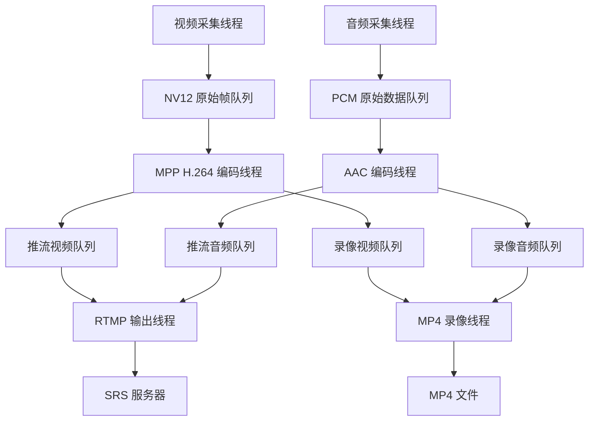

# RK3568 IPC 初版工程设计

本文记录 rk3568-ipc-camera 初版已确定的工程目录、模块职责、线程组织、数据传递及启动退出流程，作为后续编码依据。本阶段完成设计整理，尚未创建正式工程文件或实现业务代码。

初版采用“采集、编码、输出”三层结构，由主线程管理 6 个业务线程，通过有界队列传递数据，实现音视频采集、编码、RTMP 推流和本地 MP4 录像。

## 一、开发基线与初版范围

| 项目 | 已确定方案 |
| --- | --- |
| 硬件 | 正点原子 RK3568，现有 IMX415 MIPI 摄像头 |
| 系统 | 现有 Buildroot 系统，ARM64 |
| 开发语言 | C，调用 V4L2、ALSA、RKMPP 和 FFmpeg 库 |
| 编译环境 | Ubuntu，沿用 RK3568 SDK 配套 Buildroot 工具链与 sysroot |
| 视频输入 | `/dev/video0`，V4L2 多平面 API，MMAP |
| 视频格式 | 1280×720、NV12；目标 30fps，以实际采集结果为准 |
| 视频编码 | RKMPP H.264 硬件编码 |
| 音频输入 | ALSA，板载录音设备 `hw:0,0` |
| 音频参数 | 沿用已验证的采样率、声道数和 PCM 格式，在配置中明确填写 |
| 音频编码 | PCM 格式转换及分帧后，编码为 AAC |
| FFmpeg | 沿用 SDK 原有 4.4.1 版本和配套库 |
| 网络输出 | FLV 封装，经 RTMP 推送到 SRS |
| 本地输出 | MP4 音视频录像，正常退出后可回放 |
| 启停方式 | 手动启动，支持有序退出 |

程序启动时主动设置并读回 1280×720 NV12，避免沿用设备当前的 4K 配置。初版不采用 4K，也不增加 HDMI 预览、RGA/DRM 显示、零拷贝、自动重连、断电恢复、开机自启或进程守护。

开发板基础功能按此前已完成的测试处理，不重复开展整板验证。后续只针对新接入的模块、数据接口和实际故障进行验证。

## 二、工程目录

根目录保持为 `rk3568-ipc-camera`，保留现有 `demo/`，在根目录组织正式工程。

| 路径 | 内容与职责 |
| --- | --- |
| `README.md` | 项目目标、架构、编译与运行方法 |
| `Makefile` | 正式工程构建入口，管理源文件、编译和链接选项 |
| `demo/` | 现有学习实验，保持独立 |
| `include/` | 模块对外头文件和公共类型 |
| `src/` | 正式工程源码，初版按模块平铺 |
| `configs/ipc.conf` | 摄像头、音频、编码、推流地址和录像路径配置 |
| `scripts/build.sh` | 设置 SDK 工具链及 sysroot，调用 Makefile |
| `scripts/run.sh` | 前台启动程序并指定配置文件 |
| `docs/` | 环境说明、设计文档、调试记录和验收结果 |
| `build/` | 编译中间文件，排除于 Git 提交之外 |
| `bin/` | 最终程序 `ipc_camera`，排除于 Git 提交之外 |
| `.gitignore` | 排除构建产物、日志、裸数据和录像文件 |

除 `main.c` 外，各模块在 `include/` 下提供同名头文件。录像写入板端配置目录，例如 `/userdata/record/`，不写入源码目录。`run.sh` 初版只负责启动，不承担守护或自动重启。

### 编译配置的复用

沿用现有 [demo 构建脚本](https://github.com/Lenmoncc/rk3568-ipc-camera/blob/main/demo/V4L2_Extension/build.sh) 的配置方式：

| 配置项 | 路径或规则 |
| --- | --- |
| SDK 根目录 | 默认 `$HOME/rk3568_linux_sdk`，允许通过 `SDK_ROOT` 覆盖 |
| 板级构建目录 | `$SDK_ROOT/buildroot/output/rockchip_atk_dlrk3568` |
| C 编译器 | 板级构建目录下 `host/bin/aarch64-buildroot-linux-gnu-gcc` |
| C++ 编译器 | 同目录的 `aarch64-buildroot-linux-gnu-g++`，需要时使用 |
| sysroot | 板级构建目录下 `host/aarch64-buildroot-linux-gnu/sysroot` |
| 头文件与目标库 | 从该 sysroot 及 SDK 配套开发产物中引用 |
| 间接依赖搜索 | 复用 `-rpath-link` 方式，不把 Ubuntu 开发路径写入板端运行路径 |

主工程新增 FFmpeg、ALSA、MPP 的头文件和链接依赖检查。现有 demo 中的 OpenCV、libv4lconvert 依赖不直接搬入推流主链路；NV12 进入 MPP 前不需要转换成 RGB。

## 三、模块职责

| 模块 | 输入 | 输出 | 核心职责 |
| --- | --- | --- | --- |
| `main.c` | 启动参数 | 应用运行状态 | 初始化、创建线程、协调退出和释放资源 |
| `config.c` | 配置文件 | 统一配置对象 | 读取并校验设备、尺寸、音频、码率和输出路径等参数 |
| `frame_queue.c` | 原始视频帧或音频块 | 按顺序取出的数据 | 有界缓存、线程同步、关闭与清理 |
| `packet_queue.c` | 编码包 | 按顺序取出的编码包 | 包引用管理、队列关闭和生命周期管理 |
| `v4l2_capture.c` | 摄像头设备 | NV12 视频帧 | 多平面接口、MMAP、取帧、归还驱动缓冲区 |
| `alsa_capture.c` | 录音设备 | PCM 音频块 | ALSA 配置、录音和采集错误处理 |
| `video_encoder.c` | NV12 视频帧 | H.264 编码包 | 调用 MPP、管理编码输入内存和编码参数 |
| `audio_encoder.c` | PCM 音频块 | AAC 编码包 | swresample 格式转换、采样缓冲、分帧和 AAC 编码 |
| `rtmp_output.c` | H.264、AAC 编码包 | RTMP 网络流 | FLV 封装、时间基转换及网络写入 |
| `mp4_output.c` | H.264、AAC 编码包 | MP4 文件 | 创建轨道、交错写入和文件收尾 |
| `timestamp.c` | 采集时间、采样计数 | 时间戳 | 共同起点及时间单位转换 |
| `log.c` | 模块运行信息 | 终端日志 | 统一日志级别、模块名及错误信息 |

公共头文件：

- `media_types.h`：原始视频帧、音频块、编码参数等类型定义。
- `app.h`：应用上下文，汇总配置、队列、线程句柄和运行状态。

模块管理自己创建的设备句柄、编码器、封装上下文和内存。主线程负责协调生命周期，不直接承担采集、编码和写包工作。公共定义可以集中，业务实现不集中堆入一个 `common.c`。

## 四、线程组织

采用主线程加 6 个业务线程：

| 线程 | 工作 | 数据来源 | 数据去向 |
| --- | --- | --- | --- |
| 主线程 | 生命周期管理、退出协调 | 配置、退出信号、模块状态 | 各模块和业务线程 |
| 视频采集线程 | 获取 NV12 | 摄像头 | 视频原始帧队列 |
| 音频采集线程 | 获取 PCM | 声卡 | 音频原始数据队列 |
| 视频编码线程 | MPP H.264 编码 | 视频原始帧队列 | 推流视频队列、录像视频队列 |
| 音频编码线程 | PCM 转换与 AAC 编码 | 音频原始数据队列 | 推流音频队列、录像音频队列 |
| RTMP 输出线程 | 封装并发送音视频 | 推流音视频队列 | SRS |
| MP4 录像线程 | 封装并写入文件 | 录像音视频队列 | 本地 MP4 |

参考文档早期将推流和录像放在同一线程，本工程将两路输出分开，使网络等待不会直接阻塞录像线程。该隔离还依赖独立的有界队列和明确的满队列处理，不能让编码线程无限等待异常输出。

每个输出线程独占自己的 FFmpeg 封装上下文。同一上下文不由多个线程同时写入。

## 五、数据传递关系

共设置 2 个原始数据队列和 4 个编码包队列。视频和音频分别编码一次，编码结果向网络与录像两路分发。

推流和录像不能共同消费一个普通队列，否则一个包被其中一个消费者取出后，另一个消费者就无法获得该包。两路输出必须分别收到完整的音视频编码序列。

两个输出线程分别读取自己的音视频队列，并按时间戳组织交错写入；不能因为其中一路暂时没有数据，就永久阻塞另一条已经就绪的流。

### 5.1 原始视频帧

| 信息 | 用途 |
| --- | --- |
| 数据地址及有效长度 | 定位图像内容 |
| 实际宽高、像素格式 | 解释输入数据 |
| 行步长及必要的平面布局 | 处理内存对齐与平面位置 |
| 采集时间戳 | 建立视频时间线 |
| 帧序号 | 排查丢帧和处理顺序 |

初版使用应用自有内存保存视频帧：V4L2 取帧后复制有效图像，再将驱动缓冲区归还。应用持有的帧交给编码线程，消费完成后释放或归还应用缓冲池。

不能把驱动缓冲区指针放入队列后立即 QBUF，再让编码线程继续读取该地址；QBUF 后内存可能被下一帧覆盖。MPP 输入缓冲也要保持到编码器不再使用，具体释放时机按 SDK 接口约定处理。

### 5.2 原始音频数据

每个音频块包含 PCM 数据及长度、采样率、声道数、采样格式、每声道采样数，以及时间戳或累计采样位置。

采集线程向队列交付独立有效的音频数据，不能反复复用同一块临时内存供异步消费者读取。ALSA 单次读取长度不必等于 AAC 编码帧长度，音频编码模块负责缓存和重新分帧。

当前 FFmpeg AAC 编码器接受 FLTP。若采集采用 S16_LE，应经 libswresample 转换后送入编码器。

### 5.3 编码包和流参数

每个编码包包含压缩数据、流类型、PTS、DTS、duration、对应时间基，以及视频关键帧标记。

MPP 输出的数据必须在释放 MPP 包前转为应用可安全持有的数据，不能保留失效指针。向两路输出分发时，可使用 FFmpeg 包引用机制共享底层数据，但每路必须有独立包对象，分别管理流索引、时间基转换和释放。

H.264 SPS/PPS、AAC 编码配置、视频尺寸、音频采样率等作为流初始化参数交给输出模块，不与普通数据包的消费顺序混淆。输出模块在必要参数准备好后才能写封装头；若参数需要编码器先产生数据才能获得，应保留首批包并完成初始化协调。

## 六、时间戳与队列管理

### 6.1 时间戳原则

- 音视频采用共同时间起点，并明确各时间戳的单位和时钟来源。
- 视频使用有效的采集时间戳建立时间线，保留真实帧间隔。
- 音频根据实际采样率和累计采样数计算时间，并对齐起始偏移。
- 编码阶段保留编码器输出的 PTS/DTS 关系。
- 输出阶段分别换算至对应封装流的时间基。

推流时不随意重新生成时间戳。统一微秒单位不等于已经实现同步，最终要通过实际音画内容及持续运行检查偏移和漂移。

### 6.2 队列与异常原则

| 情况 | 处理要求 |
| --- | --- |
| 队列为空 | 等待通知，避免忙循环；关闭时能够退出等待 |
| 原始视频积压 | 可以丢弃尚未编码的旧帧，保留真实时间戳间隔 |
| 音频积压 | 明确报告异常和时间线影响，不静默丢失数据 |
| 编码包持续积压 | 报错并结束异常输出，不任意丢弃 H.264 中间帧后继续写入 |
| 某路输出结束 | 停止向该路分发，唤醒相关等待者并释放其剩余包 |
| 正常退出 | 关闭队列，按依赖顺序排空有效数据并完成封装收尾 |

所有队列都有容量上限。满队列必须返回明确状态，不能靠无限扩容或无限阻塞掩盖吞吐问题。网络和磁盘操作需要考虑超时或可中断退出，避免线程无法结束。

自动重连、关键帧恢复和长期断网运行策略不作为初版验收项。

## 七、启动与退出流程

### 7.1 启动

1. 读取配置，检查参数和输出位置。
2. 创建应用上下文及各队列。
3. 配置摄像头、声卡，读回实际参数。
4. 初始化 MPP、AAC 编码器，准备流初始化信息。
5. 准备 MP4 和 RTMP 输出；必要编码参数齐全后写封装头。
6. 启动消费者，再启动生产者，进入稳定采集、编码和输出。

上述步骤描述依赖关系。若流参数依赖首批编码结果，启动过程需设置就绪状态与有限缓存，不让输出提前写头，也不丢弃首批有效编码数据。

初始化失败时，按创建顺序的逆序释放已成功创建的资源。

### 7.2 正常退出

1. 主线程接收退出请求，通知采集线程停止。
2. 采集线程停止并关闭原始数据队列。
3. 编码线程消费剩余数据，排空编码器，关闭编码包队列。
4. 输出线程消费剩余包，完成 MP4 收尾和网络关闭。
5. 主线程等待各线程退出，释放队列及其他资源。

队列关闭要区分“还有可取数据”与“已关闭且已空”。不能仅设置全局退出标志，就让所有线程立即丢弃剩余数据或关闭仍在使用的资源。
